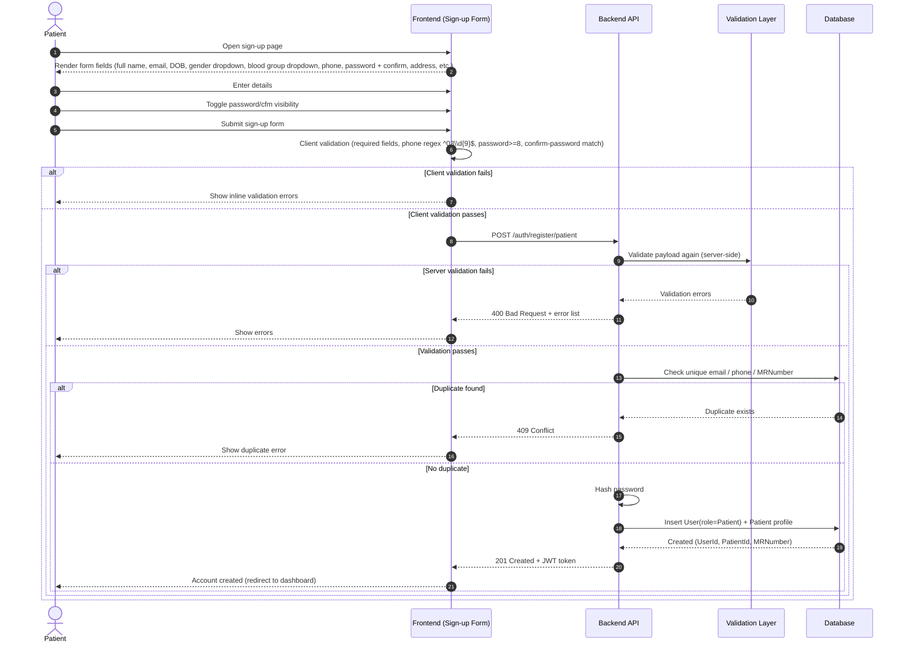
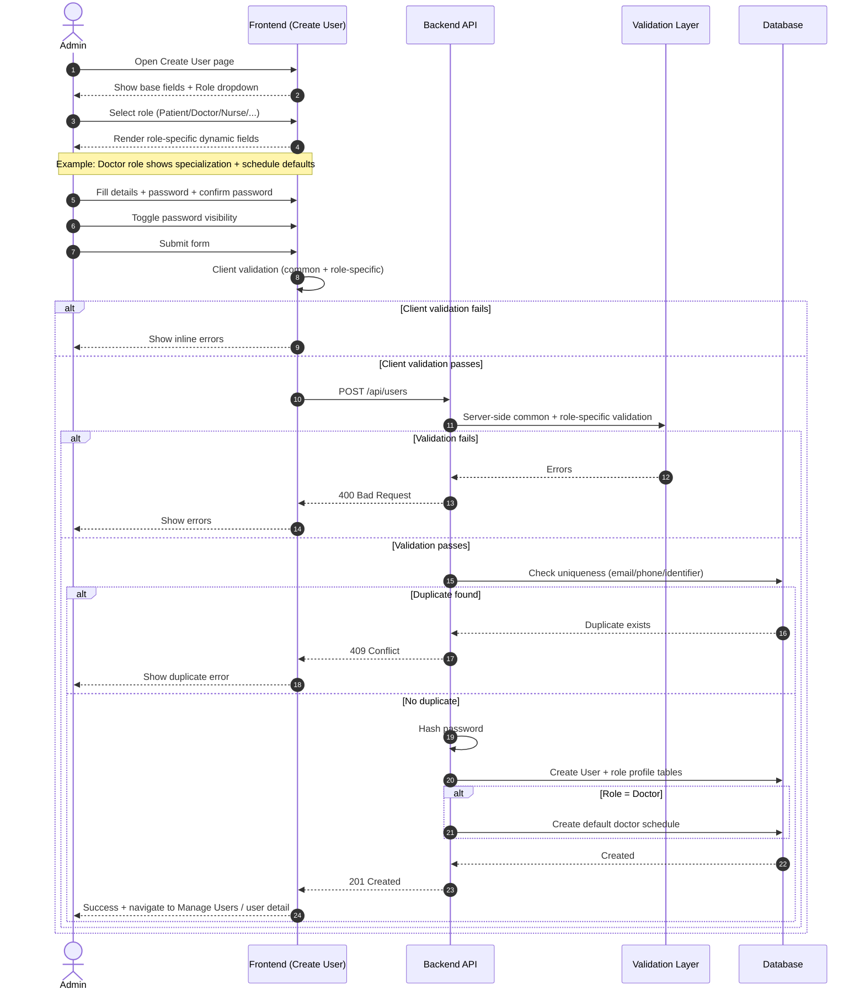
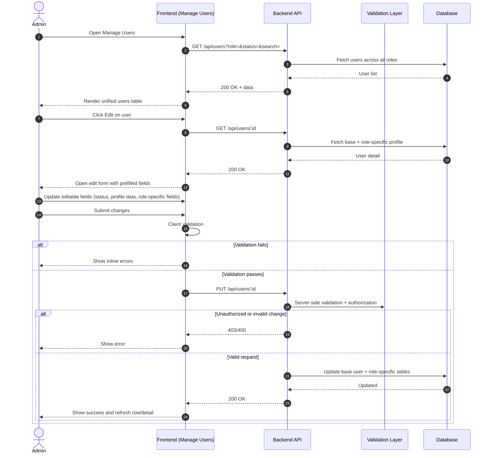

# Flow 1 User Management - Sequence Diagrams

This document defines sequence diagrams for:
- Flow 1A: Patient Self Sign-up
- Flow 1B: Admin Create User (Unified, Role-based)
- Flow 1C: Admin Manage/Edit User (Unified)

## Flow 1A - Patient Self Sign-up

## Flow 1B - Admin Create User (Unified, Role-based)

## Flow 1C - Admin Manage/Edit User (Unified)

## Notes
- Keep validation rules identical between create and edit where applicable.
- Treat dropdown-backed values as controlled enums in both frontend and backend.
- Password fields should support show/hide toggle in both patient and admin-create flows.
- Phone format validation: `^03\\d{9}$` for Pakistani mobile format.
- Patient signup and admin-create both enforce password confirmation and minimum 8-character policy.
- Gender dropdown: M/F/Other; BloodGroup dropdown: O+/O-/A+/A-/B+/B-/AB+/AB-.

