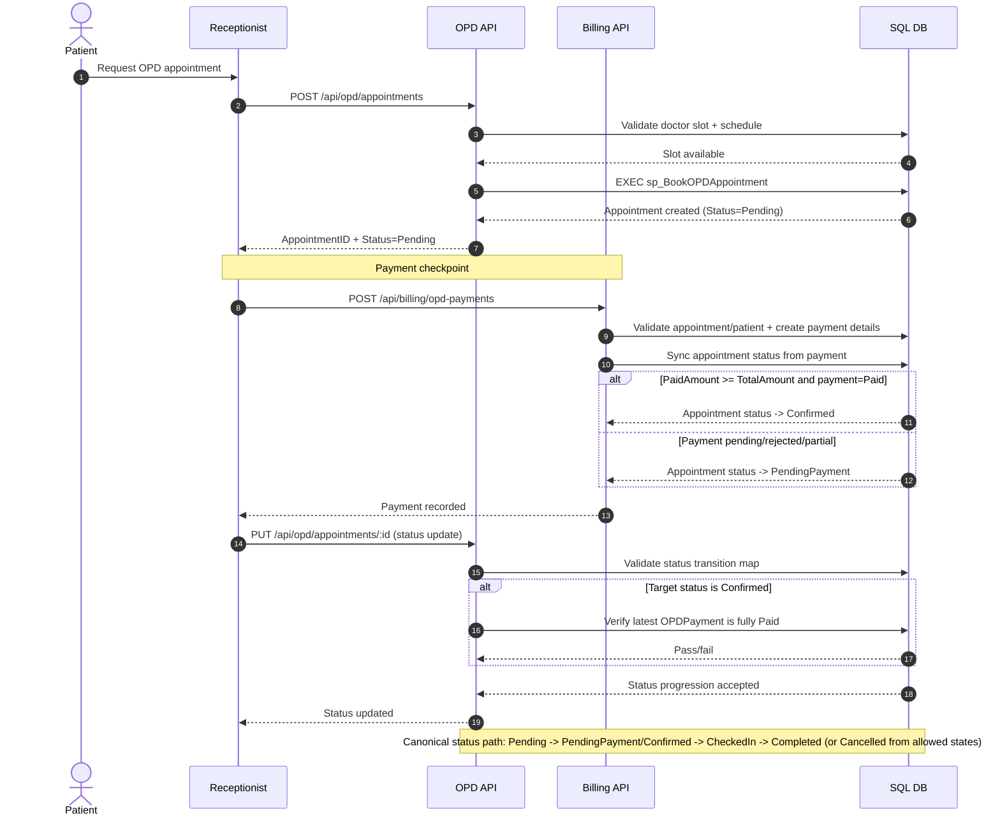

# Canonical OPD & IPD Sequence Diagrams

Implementation-aligned as of current backend controllers:
- `backend/src/controllers/opd.controller.js`
- `backend/src/controllers/ipd.controller.js`
- `backend/src/controllers/billing.controller.js`

## OPD Canonical Flow (Appointment + Payment-Gated Progression)



## IPD Canonical Flow (Admission + Billing Checkpoints)

```mermaid
sequenceDiagram
  autonumber
  actor Patient
  participant Receptionist
  participant Doctor
  participant IPDAPI as IPD API
  participant BillingAPI as Billing API
  participant DB as SQL DB

  Doctor->>Receptionist: Recommend IPD admission
  Receptionist->>IPDAPI: POST /api/ipd/admissions
  IPDAPI->>DB: Validate doctor-ward assignment
  IPDAPI->>DB: Validate bed belongs to ward and is Available
  IPDAPI->>DB: EXEC sp_AdmitPatientTransactional
  DB-->>IPDAPI: Admission created + bed occupied
  IPDAPI-->>Receptionist: AdmissionID (typical Status=Admitted)

  Note over Receptionist,BillingAPI: Payment checkpoint #1 (admission billing entry)
  Receptionist->>BillingAPI: POST /api/billing/ipd-payments
  BillingAPI->>DB: Validate admission/patient + create payment details
  DB-->>BillingAPI: IPDPayment created (Paid/Pending by amount)
  BillingAPI-->>Receptionist: Billing record created

  Receptionist->>IPDAPI: PUT /api/ipd/admissions/:id (care progression)
  IPDAPI->>DB: Update admission fields/status
  alt Bed changed
    IPDAPI->>DB: Previous bed -> Available
  end
  IPDAPI-->>Receptionist: Admission updated

  Note over Receptionist,BillingAPI: Payment checkpoint #2 (ongoing/settlement updates)
  Receptionist->>BillingAPI: PUT /api/billing/ipd-payments/:id
  BillingAPI->>DB: Update paid/total/status
  BillingAPI-->>Receptionist: Payment status refreshed

  Note over IPDAPI,DB: IPD status values are update-driven (default on update: Admitted); no strict transition map enforced in controller today.
```
